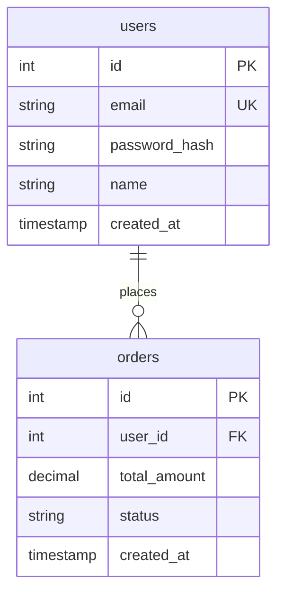

# スキーマ生成スキル

DB設計からマイグレーション・モデルコードを生成します。

## 使用方法
```
/doc:schema <設計入力> [--orm=<ORM>] [--output=<出力先>]
```

---

## When to Use

- 新規テーブル設計
- ER図からコード生成
- 既存スキーマのマイグレーション
- モデル定義の自動生成

## Scope

| 言語 | ORM/ライブラリ |
|------|---------------|
| TypeScript | Prisma, TypeORM, Drizzle |
| Python | SQLAlchemy, Tortoise ORM |
| Go | GORM, sqlx |

---

## 入力形式

### 自然言語

```
/doc:schema "ユーザーテーブル: ID, メール(ユニーク), パスワード, 名前, 作成日時"
```

### SQL DDL

```sql
CREATE TABLE users (
  id SERIAL PRIMARY KEY,
  email VARCHAR(255) UNIQUE NOT NULL,
  password_hash VARCHAR(255) NOT NULL,
  name VARCHAR(100) NOT NULL,
  created_at TIMESTAMP DEFAULT NOW(),
  updated_at TIMESTAMP DEFAULT NOW()
);
```

### ER図（Mermaid）



---

## ORM別出力

### Prisma (TypeScript)

```prisma
// prisma/schema.prisma
generator client {
  provider = "prisma-client-js"
}

datasource db {
  provider = "postgresql"
  url      = env("DATABASE_URL")
}

model User {
  id           Int      @id @default(autoincrement())
  email        String   @unique
  passwordHash String   @map("password_hash")
  name         String
  createdAt    DateTime @default(now()) @map("created_at")
  updatedAt    DateTime @updatedAt @map("updated_at")

  orders Order[]

  @@map("users")
}

model Order {
  id          Int      @id @default(autoincrement())
  userId      Int      @map("user_id")
  totalAmount Decimal  @map("total_amount") @db.Decimal(10, 2)
  status      String   @default("pending")
  createdAt   DateTime @default(now()) @map("created_at")

  user User @relation(fields: [userId], references: [id])

  @@map("orders")
}
```

マイグレーション:
```bash
npx prisma migrate dev --name add_users_and_orders
```

### TypeORM (TypeScript)

```typescript
// entities/user.entity.ts
import {
  Entity,
  PrimaryGeneratedColumn,
  Column,
  CreateDateColumn,
  UpdateDateColumn,
  OneToMany,
} from 'typeorm';
import { Order } from './order.entity';

@Entity('users')
export class User {
  @PrimaryGeneratedColumn()
  id: number;

  @Column({ unique: true })
  email: string;

  @Column({ name: 'password_hash' })
  passwordHash: string;

  @Column({ length: 100 })
  name: string;

  @CreateDateColumn({ name: 'created_at' })
  createdAt: Date;

  @UpdateDateColumn({ name: 'updated_at' })
  updatedAt: Date;

  @OneToMany(() => Order, order => order.user)
  orders: Order[];
}

// entities/order.entity.ts
import {
  Entity,
  PrimaryGeneratedColumn,
  Column,
  CreateDateColumn,
  ManyToOne,
  JoinColumn,
} from 'typeorm';
import { User } from './user.entity';

@Entity('orders')
export class Order {
  @PrimaryGeneratedColumn()
  id: number;

  @Column({ name: 'user_id' })
  userId: number;

  @Column('decimal', { name: 'total_amount', precision: 10, scale: 2 })
  totalAmount: number;

  @Column({ default: 'pending' })
  status: string;

  @CreateDateColumn({ name: 'created_at' })
  createdAt: Date;

  @ManyToOne(() => User, user => user.orders)
  @JoinColumn({ name: 'user_id' })
  user: User;
}
```

マイグレーション:
```typescript
// migrations/1234567890-CreateUsersAndOrders.ts
import { MigrationInterface, QueryRunner, Table, TableForeignKey } from 'typeorm';

export class CreateUsersAndOrders1234567890 implements MigrationInterface {
  public async up(queryRunner: QueryRunner): Promise<void> {
    // Users table
    await queryRunner.createTable(
      new Table({
        name: 'users',
        columns: [
          { name: 'id', type: 'int', isPrimary: true, isGenerated: true, generationStrategy: 'increment' },
          { name: 'email', type: 'varchar', length: '255', isUnique: true },
          { name: 'password_hash', type: 'varchar', length: '255' },
          { name: 'name', type: 'varchar', length: '100' },
          { name: 'created_at', type: 'timestamp', default: 'CURRENT_TIMESTAMP' },
          { name: 'updated_at', type: 'timestamp', default: 'CURRENT_TIMESTAMP', onUpdate: 'CURRENT_TIMESTAMP' },
        ],
      }),
      true,
    );

    // Orders table
    await queryRunner.createTable(
      new Table({
        name: 'orders',
        columns: [
          { name: 'id', type: 'int', isPrimary: true, isGenerated: true, generationStrategy: 'increment' },
          { name: 'user_id', type: 'int' },
          { name: 'total_amount', type: 'decimal', precision: 10, scale: 2 },
          { name: 'status', type: 'varchar', length: '20', default: "'pending'" },
          { name: 'created_at', type: 'timestamp', default: 'CURRENT_TIMESTAMP' },
        ],
      }),
      true,
    );

    // Foreign key
    await queryRunner.createForeignKey(
      'orders',
      new TableForeignKey({
        columnNames: ['user_id'],
        referencedTableName: 'users',
        referencedColumnNames: ['id'],
        onDelete: 'CASCADE',
      }),
    );
  }

  public async down(queryRunner: QueryRunner): Promise<void> {
    await queryRunner.dropTable('orders');
    await queryRunner.dropTable('users');
  }
}
```

### Drizzle (TypeScript)

```typescript
// db/schema.ts
import {
  pgTable,
  serial,
  varchar,
  timestamp,
  decimal,
  integer,
} from 'drizzle-orm/pg-core';
import { relations } from 'drizzle-orm';

export const users = pgTable('users', {
  id: serial('id').primaryKey(),
  email: varchar('email', { length: 255 }).unique().notNull(),
  passwordHash: varchar('password_hash', { length: 255 }).notNull(),
  name: varchar('name', { length: 100 }).notNull(),
  createdAt: timestamp('created_at').defaultNow().notNull(),
  updatedAt: timestamp('updated_at').defaultNow().notNull(),
});

export const orders = pgTable('orders', {
  id: serial('id').primaryKey(),
  userId: integer('user_id').references(() => users.id).notNull(),
  totalAmount: decimal('total_amount', { precision: 10, scale: 2 }).notNull(),
  status: varchar('status', { length: 20 }).default('pending').notNull(),
  createdAt: timestamp('created_at').defaultNow().notNull(),
});

// Relations
export const usersRelations = relations(users, ({ many }) => ({
  orders: many(orders),
}));

export const ordersRelations = relations(orders, ({ one }) => ({
  user: one(users, {
    fields: [orders.userId],
    references: [users.id],
  }),
}));

// Types
export type User = typeof users.$inferSelect;
export type NewUser = typeof users.$inferInsert;
export type Order = typeof orders.$inferSelect;
export type NewOrder = typeof orders.$inferInsert;
```

### SQLAlchemy (Python)

```python
# models/user.py
from datetime import datetime
from sqlalchemy import Column, Integer, String, DateTime, ForeignKey, Numeric
from sqlalchemy.orm import relationship, Mapped, mapped_column
from .base import Base

class User(Base):
    __tablename__ = 'users'

    id: Mapped[int] = mapped_column(primary_key=True)
    email: Mapped[str] = mapped_column(String(255), unique=True, nullable=False)
    password_hash: Mapped[str] = mapped_column(String(255), nullable=False)
    name: Mapped[str] = mapped_column(String(100), nullable=False)
    created_at: Mapped[datetime] = mapped_column(DateTime, default=datetime.utcnow)
    updated_at: Mapped[datetime] = mapped_column(
        DateTime, default=datetime.utcnow, onupdate=datetime.utcnow
    )

    orders: Mapped[list["Order"]] = relationship(back_populates="user")


class Order(Base):
    __tablename__ = 'orders'

    id: Mapped[int] = mapped_column(primary_key=True)
    user_id: Mapped[int] = mapped_column(ForeignKey('users.id'), nullable=False)
    total_amount: Mapped[Numeric] = mapped_column(Numeric(10, 2), nullable=False)
    status: Mapped[str] = mapped_column(String(20), default='pending')
    created_at: Mapped[datetime] = mapped_column(DateTime, default=datetime.utcnow)

    user: Mapped["User"] = relationship(back_populates="orders")
```

Alembicマイグレーション:
```python
# alembic/versions/xxxx_create_users_and_orders.py
"""create users and orders tables

Revision ID: xxxx
"""
from alembic import op
import sqlalchemy as sa

def upgrade() -> None:
    op.create_table(
        'users',
        sa.Column('id', sa.Integer(), primary_key=True),
        sa.Column('email', sa.String(255), unique=True, nullable=False),
        sa.Column('password_hash', sa.String(255), nullable=False),
        sa.Column('name', sa.String(100), nullable=False),
        sa.Column('created_at', sa.DateTime(), server_default=sa.func.now()),
        sa.Column('updated_at', sa.DateTime(), server_default=sa.func.now(), onupdate=sa.func.now()),
    )

    op.create_table(
        'orders',
        sa.Column('id', sa.Integer(), primary_key=True),
        sa.Column('user_id', sa.Integer(), sa.ForeignKey('users.id'), nullable=False),
        sa.Column('total_amount', sa.Numeric(10, 2), nullable=False),
        sa.Column('status', sa.String(20), server_default='pending'),
        sa.Column('created_at', sa.DateTime(), server_default=sa.func.now()),
    )

def downgrade() -> None:
    op.drop_table('orders')
    op.drop_table('users')
```

### GORM (Go)

```go
// models/user.go
package models

import (
    "time"
    "gorm.io/gorm"
)

type User struct {
    ID           uint           `gorm:"primaryKey"`
    Email        string         `gorm:"type:varchar(255);uniqueIndex;not null"`
    PasswordHash string         `gorm:"column:password_hash;type:varchar(255);not null"`
    Name         string         `gorm:"type:varchar(100);not null"`
    CreatedAt    time.Time      `gorm:"autoCreateTime"`
    UpdatedAt    time.Time      `gorm:"autoUpdateTime"`
    Orders       []Order        `gorm:"foreignKey:UserID"`
}

type Order struct {
    ID          uint           `gorm:"primaryKey"`
    UserID      uint           `gorm:"not null;index"`
    TotalAmount float64        `gorm:"type:decimal(10,2);not null"`
    Status      string         `gorm:"type:varchar(20);default:pending"`
    CreatedAt   time.Time      `gorm:"autoCreateTime"`
    User        User           `gorm:"foreignKey:UserID"`
}

// TableName overrides
func (User) TableName() string {
    return "users"
}

func (Order) TableName() string {
    return "orders"
}

// AutoMigrate
func Migrate(db *gorm.DB) error {
    return db.AutoMigrate(&User{}, &Order{})
}
```

---

## 出力形式

```
═══════════════════════════════════════════════════════════
  スキーマ生成: ユーザー・注文システム
═══════════════════════════════════════════════════════════

【入力】
  形式: 自然言語
  テーブル数: 2

【生成ファイル】

Prisma:
  - prisma/schema.prisma

TypeORM:
  - src/entities/user.entity.ts
  - src/entities/order.entity.ts
  - src/migrations/xxx-CreateUsersAndOrders.ts

Drizzle:
  - src/db/schema.ts

SQLAlchemy:
  - models/user.py
  - models/order.py
  - alembic/versions/xxx_create_tables.py

GORM:
  - models/user.go
  - models/order.go

【次のステップ】

TypeScript (Prisma):
  npx prisma migrate dev --name init

Python (Alembic):
  alembic upgrade head

Go (GORM):
  db.AutoMigrate(&models.User{}, &models.Order{})
```

---

## オプション

| オプション | 説明 | 例 |
|-----------|------|-----|
| `--orm` | 使用するORM | `--orm=prisma` |
| `--db` | データベース種類 | `--db=postgresql` |
| `--output` | 出力ディレクトリ | `--output=src/db` |

---

## 引数

$ARGUMENTS
